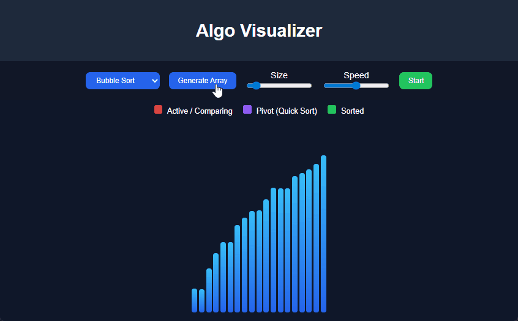

# 🔥 Algorithm Visualizer



An interactive **Sorting Algorithm Visualizer** built with **React**
that helps users understand how different sorting algorithms work
through real-time animations.

------------------------------------------------------------------------

## 🚀 Features

-   🎯 Visualize multiple sorting algorithms:
    -   Bubble Sort
    -   Selection Sort
    -   Insertion Sort
    -   Merge Sort
    -   Quick Sort
-   🎨 Color-coded animations:
    -   🔴 Red → Elements being compared
    -   🟣 Purple → Pivot (Quick Sort)
    -   🟢 Green → Sorted elements
-   ⚡ Adjustable controls:
    -   Array size
    -   Animation speed
-   📊 Live analytics:
    -   Real-time **comparison counter**
-   🧠 Educational UI:
    -   Legend for color meanings
    -   Step-by-step visual execution

------------------------------------------------------------------------

## 🛠️ Tech Stack

-   **Frontend:** React (Functional Components + Hooks)
-   **Styling:** CSS (Flexbox + Transitions)
-   **Core Concepts:**
    -   Async/Await for animations
    -   State-driven rendering
    -   Algorithm visualization logic

------------------------------------------------------------------------

## 📂 Project Structure

    /src
    ├── App.jsx
    ├── styles.css

------------------------------------------------------------------------

## 🖥️ Installation & Setup

``` bash
git clone https://github.com/your-username/algorithm-visualizer.git
cd algorithm-visualizer
npm install
npm start
```

------------------------------------------------------------------------


## ⭐ Show Your Support

Give it a ⭐ if you like it!

------------------------------------------------------------------------

## 📬 Contact

Created by **Ansh Singh**
